# UI

```cmd
~$ composer require laravel/fortify
```

```cmd
~$ php artisan vendor:publish --provider="Laravel\Fortify\FortifyServiceProvider"
```

```cmd
~$ php artisan migrate
```

Add below code to `app.php` in `Application Service Providers` array

```php
App\Providers\FortifyServiceProvider::class,
```

Add below code inside `boot()` function in `FortifyServiceProvider.php`.

```php
        Fortify::loginView(function () {
            return view('auth.login');
        });

        Fortify::registerView(function () {
            return view('auth.register');
        });

        Fortify::requestPasswordResetLinkView(function () {
            return view('auth.passwords.email');
        });

        Fortify::resetPasswordView(function ($request) {
            return view('auth.passwords.reset', ['request' => $request]);
        });
```

Copy Past Bootstrap `Views` files from other project to `Fortify` projects `views`

Create the below route

```php
Route::view('home', 'home')->middleware('auth');
```

---

---

# Log In with Username instead of Email

> [Link](https://www.tutsplanet.com/laravel-auth-login-with-username-instead-of-email)

# **Advanced Laravel**

---

# **Form Request Validation #1**

---

## Inefficient Way

`form.blade.php`

```php
<div class="col-lg-offset-4 col-lg-6">

    @if(count($errors)>0)
        @foreach ($errors->all() as $error)
            <p class="alert alert-danger">{{ $error }}</p>
        @endforeach
    @endif

    <form  method="post" action="{{ route('form.store') }}" enctype="multipart/form-data">
        @csrf
        <div class="form-group">
            <input class="form-control" type="text" name="name" placeholder="Name"/>
        </div>
        <div class="form-group">
            <input class="form-control" type="text" name="email" placeholder="Email"/>
        </div>
        <button class="btn btn-success" type="submit" name="submit">Submit</button>

    </form>
    <br/>

</div>
```

`web.php`

```php
Route::get('/form', [FormController::class, 'index'])->name('form.index');
Route::post('/form/store', [FormController::class, 'store'])->name('form.store');
```

`FormController.php`

```php
public function store(Request $request)
{
    $this->validate(
        $request,
        [
            'name' => 'required|max:20',
            'email' => 'required|max:40',
        ]
    );
}
```

## Efficiant Way

Create Request validation

```cmd
~$ php artisan make:request StoreFormValidation
```

`StoreFormValidation.php`

```php
<?php

namespace App\Http\Requests;

use Illuminate\Foundation\Http\FormRequest;

class StoreFormValidation extends FormRequest
{
    /**
     * Determine if the user is authorized to make this request.
     *
     * @return bool
     */
    public function authorize()
    {
        return true;
    }

    /**
     * Get the validation rules that apply to the request.
     *
     * @return array
     */
    public function rules()
    {
        return [
            'name' => 'required|max:20',
            'email' => 'required|max:40',
        ];
    }

    public function messages()
    {
        return [
            'name.required' => 'Please input a Name',
            'name.max' => 'Name should not more than 20 charecters',
            'email.required' => 'Please input an Email',
            'email.max' => 'Email should not more than 40 charecters',
        ];
    }
}

```

> `return true` for `authorize` function.

`FormController.php`

```php
public function store(StoreFormValidation $request)
{
    //
}
```

## Output

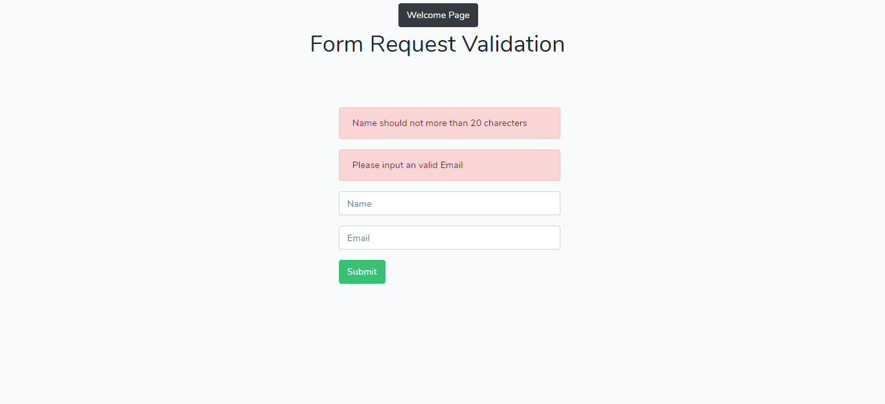

---

# **Rest API**

---

## Configuarations

```cmd
~$ php artisan make:model Task -mf
~$ php artisan make:controller Api/TaskController -r
```

Install Laravel Passport

```cmd
~$ composer require laravel/passport
~$ php artisan migrate
~$ php artisan passport:install
```

`User.php`

```php
class User extends Authenticatable
{
    use HasApiTokens;
}
```

`AuthServiceProvider.php`

```php
public function boot()
{
    $this->registerPolicies();
    Passport::routes(); //added
}
```

`config/auth.php`

```php
'api' => [
        'driver' => 'passport',
        'provider' => 'users',
        'hash' => false,
    ],
```

```cmd
~$ php artisan make:controller Api/AuthController -r
```

---

# **Registration using API**

---

`AuthController.php`

```php
    public function register(Request $request)
    {
        $validatedData = $request->validate([
            'name' => 'required|max:55',
            'email' => 'required|unique:users',
            'password' => 'required|confirmed'
        ]);

        $validatedData['password'] = Hash::make($request->password);

        $user = User::create($validatedData);

        $accessToken = $user->createToken('authToken')->accessToken;

        return response(['user' => $user, 'access_token' => $accessToken]);
    }
```

`api.php`

```php
Route::post('/register', [AuthController::class, 'register']);
```

## Postman Visualize

Settings for the registration

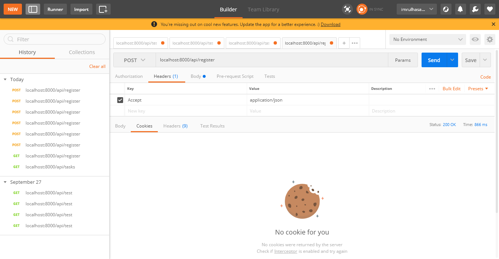

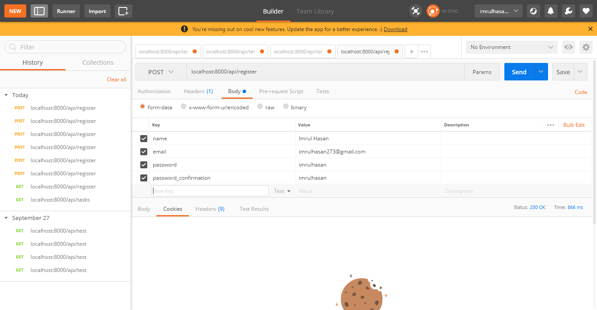

After Send POST Request

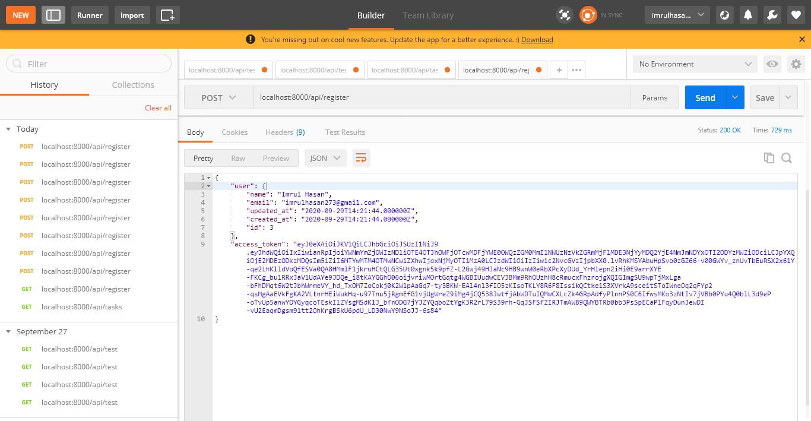

> User insertion successfull

If password does not match.

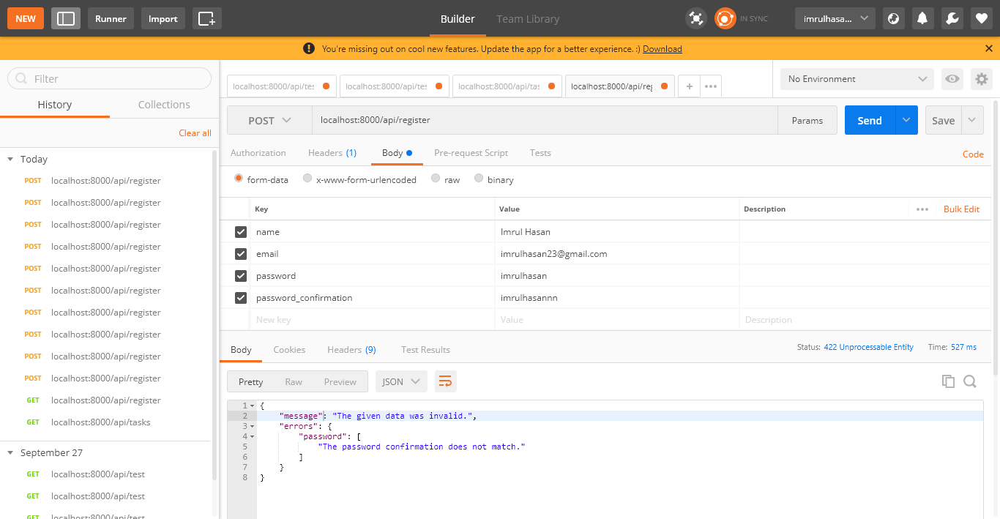

> Validation message.

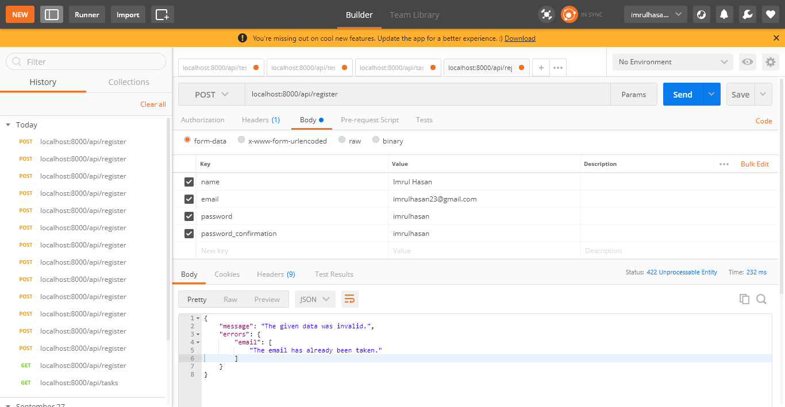

> Validation error message that shows email should be unique

---

---

# **Login using API**

---

`api.php`

```php
Route::post('/login', [AuthController::class, 'login']);
```

`AuthController.php`

```php
    public function login(Request $request)
    {
        $LoginData = $request->validate([
            'email' => 'required',
            'password' => 'required '
        ]);

        if (!Auth::attempt($LoginData)) {
            return response(['message' => 'Invalid Credentials']);
        }

        $accessToken = Auth::user()->createToken('authToken')->accessToken;
        return response(['user' => Auth::user(), 'access_token' => $accessToken]);
    }
```

## Postman Visualize

Settings for the login

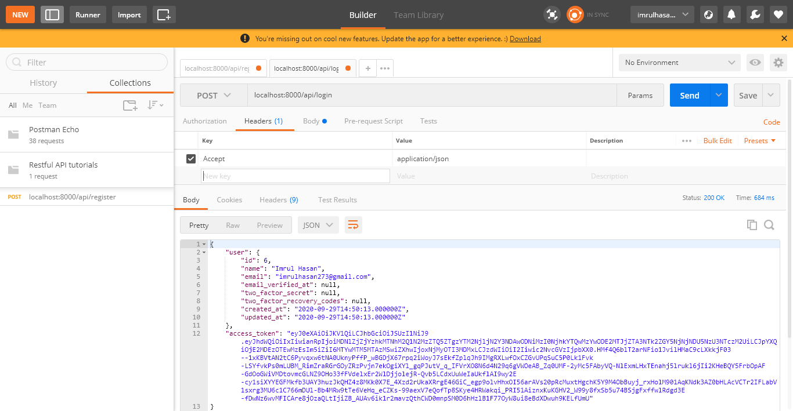

After Sending Post Request

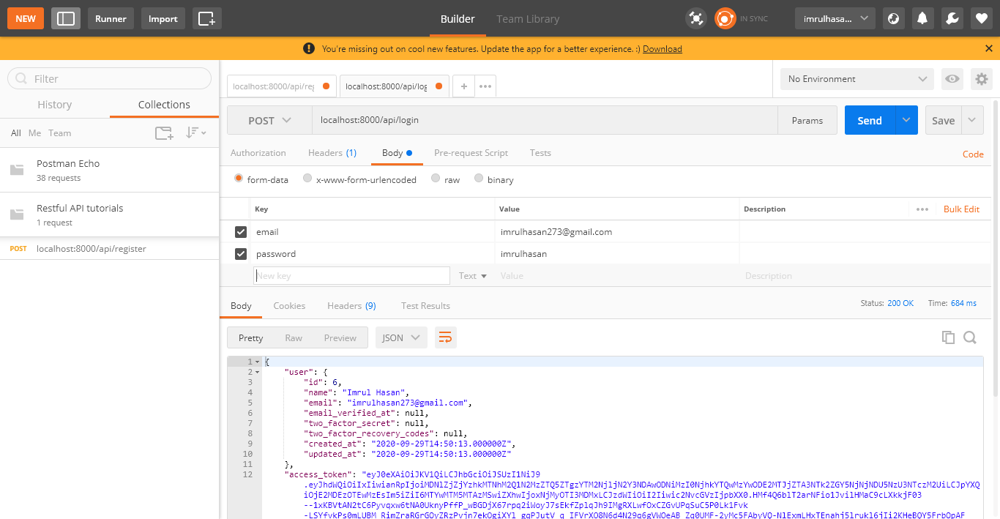

---

---

# **Task CRUD using API**

---

```cmd
~$ php artisan passport:install

```

`TaskFactory.php`

```php
    public function definition()
    {
        return [
            'title' => $this->faker->company,
            'description' => $this->faker->paragraph(20),
            'user_id' => '8' //Make sure this user id exists.
        ];
    }
```

Now run the Seeder [We don't use DataBase Seeder now.]

```cmd
~$ php artisan tinker
~$ App\Models\Task::factory(5)->create()
```

## Data Fetching (Read Operation)

`api.php`

```php
Route::apiResource('/tasks', TaskController::class);
// Route::get('/tasks', [TaskController::class, 'index']);
```

`TaskController.php`

```php
public function index()
{
    return Task::all();
}
```

---

## Postman Visualize

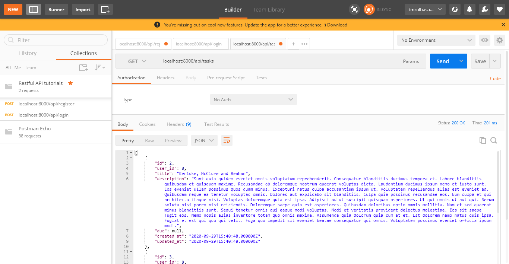

> We can get all the tasks

> But this is not good way to retrive data using index function in TaskController.

---

## Good Approach

```cmd
~$ php artisan make:resource TaskResource
```

`api.php`

```php
Route::apiResource('/tasks', TaskController::class)->middleware('auth:api');
```

`Task.php`

```php
class Task extends Model
{
    use HasFactory;

    protected $guarded = ['user_id'];

    public function creator()
    {
        return $this->belongsTo(User::class, 'user_id', 'id');
    }
}
```

`User.php`

```php
public function tasks()
{
    return $this->hasMany(Task::class);
}
```

`TaskController.php`

```php
public function index()
{
    return TaskResource::collection(Auth::user()->tasks()->with('creator')->latest()->paginate(4));
}
```

-   Now first Login from postman visualizer.
-   Get the access token from login information in `localhost:8000/api/login`
-   put the token to header in `Authorization` key in `localhost:8000/api/tasks`

> Login Now

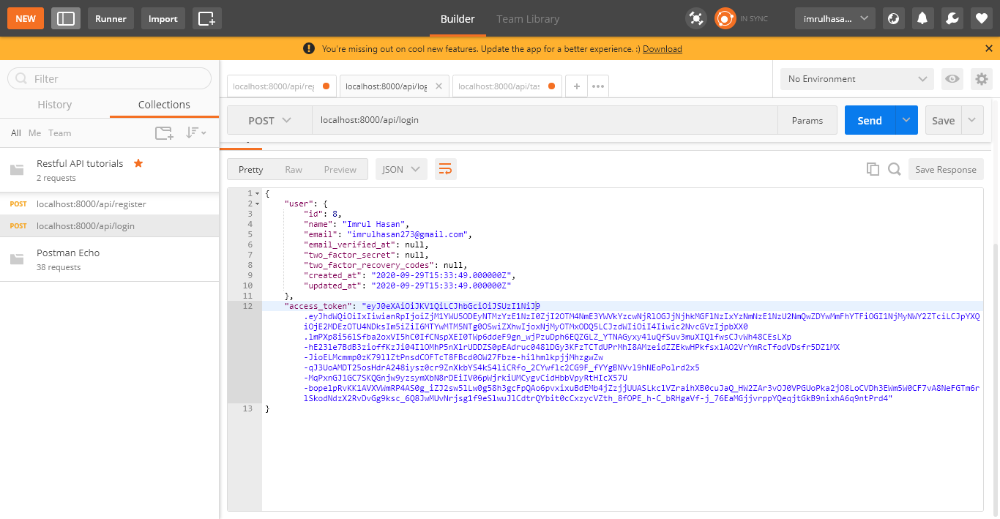

> Now SEND a GET Request

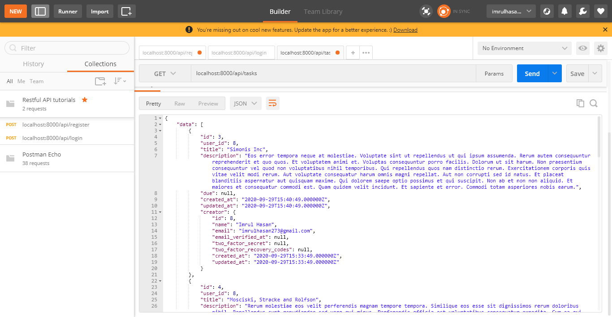

> We can see after log in all the tasks belongs to the auth user are retrives here.

Output in JSON formate

```json
{
    "data": [
        {
            "id": 3,
            "user_id": 8,
            "title": "Simonis Inc",
            "description": "Eos error tempora neque at molestiae. Voluptate sint ut repellendus ut qui ipsum assumenda. Rerum autem consequuntur reprehenderit et quo quos. Et voluptatem animi et. Voluptas consequuntur porro facilis. Dolorum ut sit harum. Non praesentium consequuntur vel quod non voluptatibus nihil temporibus. Qui repellendus quos nam distinctio rerum. Exercitationem corporis quis vitae velit modi rerum. Aut voluptate consequatur harum omnis magni repellat. Aut non corrupti sed id natus. Et placeat blanditiis aspernatur aut quisquam maxime. Qui dolorem saepe optio possimus et qui suscipit. Non ab et non non aliquid. Et maiores et consequatur commodi est. Quam quidem velit incidunt. Et sapiente et error. Commodi totam asperiores nobis earum.",
            "due": null,
            "created_at": "2020-09-29T15:40:49.000000Z",
            "updated_at": "2020-09-29T15:40:49.000000Z",
            "creator": {
                "id": 8,
                "name": "Imrul Hasan",
                "email": "imrulhasan273@gmail.com",
                "email_verified_at": null,
                "two_factor_secret": null,
                "two_factor_recovery_codes": null,
                "created_at": "2020-09-29T15:33:49.000000Z",
                "updated_at": "2020-09-29T15:33:49.000000Z"
            }
        },
        {
            "id": 4,
            "user_id": 8,
            "title": "Mosciski, Stracke and Rolfson",
            "description": "Rerum molestiae eos velit perferendis magnam tempore tempora. Similique eos esse sit dignissimos rerum doloribus nihil. Repellendus sunt repudiandae sed vero qui minus. Perferendis officia est voluptatibus consequatur expedita. Cum ea qui ipsa sed. Dolor aut aspernatur perspiciatis consectetur architecto voluptatibus. Incidunt harum explicabo et. Incidunt in soluta aut nesciunt. Quis libero recusandae ut deleniti. Nisi placeat placeat pariatur. Assumenda mollitia maxime excepturi dolorum dolore ipsam veritatis. Ex optio consectetur molestiae placeat ipsam nihil distinctio. Sunt aperiam deserunt rerum. Qui dolores sint consequatur quas sint facilis. Consequatur quia qui est in debitis. Odit ut consequatur reprehenderit accusantium officiis sapiente totam. Consequuntur eligendi dolorem iusto beatae rerum unde. Ut voluptatum expedita qui eligendi ea amet corporis sed. Ut ea expedita ducimus aut. Consectetur sit nesciunt ea inventore qui quidem. Et sint repellat est omnis placeat et nobis quos. Et in error ad dolor non. Ipsa autem quidem sequi perferendis ut laudantium. Quaerat quod dolore assumenda. Aut dolor asperiores facilis occaecati ex magnam. Voluptatem maxime nulla recusandae ullam cupiditate.",
            "due": null,
            "created_at": "2020-09-29T15:40:49.000000Z",
            "updated_at": "2020-09-29T15:40:49.000000Z",
            "creator": {
                "id": 8,
                "name": "Imrul Hasan",
                "email": "imrulhasan273@gmail.com",
                "email_verified_at": null,
                "two_factor_secret": null,
                "two_factor_recovery_codes": null,
                "created_at": "2020-09-29T15:33:49.000000Z",
                "updated_at": "2020-09-29T15:33:49.000000Z"
            }
        },
        {
            "id": 5,
            "user_id": 8,
            "title": "Harber-Cummings",
            "description": "Est et et quo hic. Delectus tempore animi voluptas et vel magni nam. Quo sint laudantium aliquid vel aut. Deserunt nostrum exercitationem atque perferendis non sit libero. Officia neque quod et autem. Tenetur asperiores labore voluptatum dolores sit qui alias. Culpa neque et veniam. Est voluptatem suscipit harum omnis et id. Ad non ut est fugiat voluptas ut consectetur et. Vel est alias id. Dolores aut ab et culpa iste blanditiis voluptates quia. Rerum doloremque veniam recusandae nihil. Illo provident eum numquam voluptatem eveniet. Error rerum saepe excepturi suscipit quia et. Consectetur unde perspiciatis maxime perferendis. Qui enim dolores dolorum. Quisquam est sint rerum quas. Voluptate placeat omnis cupiditate enim quia amet. Sed eos ratione qui numquam deserunt ullam enim. Fugit quis accusantium officia iste doloremque nobis.",
            "due": null,
            "created_at": "2020-09-29T15:40:49.000000Z",
            "updated_at": "2020-09-29T15:40:49.000000Z",
            "creator": {
                "id": 8,
                "name": "Imrul Hasan",
                "email": "imrulhasan273@gmail.com",
                "email_verified_at": null,
                "two_factor_secret": null,
                "two_factor_recovery_codes": null,
                "created_at": "2020-09-29T15:33:49.000000Z",
                "updated_at": "2020-09-29T15:33:49.000000Z"
            }
        },
        {
            "id": 6,
            "user_id": 8,
            "title": "Tillman and Sons",
            "description": "Laboriosam saepe ut in labore maxime vero. Rem debitis laboriosam et voluptatem. Fugiat amet doloremque in quia veniam minima harum alias. Architecto est accusantium in tenetur aut est. Ut qui recusandae qui provident. Dolor eaque natus sit pariatur. Quis dolorem quae omnis deserunt dolores doloremque aut. Nobis quibusdam dolorem iste impedit quos. Et voluptatum eum deleniti libero omnis ipsa atque. Exercitationem rerum aliquam ratione incidunt incidunt nihil et et. Non maiores odio ab at architecto. Quisquam distinctio neque animi non reiciendis unde. Libero et facilis velit. Rerum est et nam et officiis. Velit ipsum quis vitae. Doloribus quidem sed fuga quaerat architecto omnis deserunt. Quis dolorem et officiis ex delectus.",
            "due": null,
            "created_at": "2020-09-29T15:40:49.000000Z",
            "updated_at": "2020-09-29T15:40:49.000000Z",
            "creator": {
                "id": 8,
                "name": "Imrul Hasan",
                "email": "imrulhasan273@gmail.com",
                "email_verified_at": null,
                "two_factor_secret": null,
                "two_factor_recovery_codes": null,
                "created_at": "2020-09-29T15:33:49.000000Z",
                "updated_at": "2020-09-29T15:33:49.000000Z"
            }
        }
    ],
    "links": {
        "first": "http://localhost:8000/api/tasks?page=1",
        "last": "http://localhost:8000/api/tasks?page=2",
        "prev": null,
        "next": "http://localhost:8000/api/tasks?page=2"
    },
    "meta": {
        "current_page": 1,
        "from": 1,
        "last_page": 2,
        "links": [
            {
                "url": null,
                "label": "Previous",
                "active": false
            },
            {
                "url": "http://localhost:8000/api/tasks?page=1",
                "label": 1,
                "active": true
            },
            {
                "url": "http://localhost:8000/api/tasks?page=2",
                "label": 2,
                "active": false
            },
            {
                "url": "http://localhost:8000/api/tasks?page=2",
                "label": "Next",
                "active": false
            }
        ],
        "path": "http://localhost:8000/api/tasks",
        "per_page": 4,
        "to": 4,
        "total": 5
    }
}
```

---

## Data Store (Create Operation)

`TaskController.php`

```php
    public function store(Request $request)
    {
        $request->validate([
            'title' => 'required|max:255'
        ]);

        $task = Auth::user()->tasks()->create($request->all());

        return new TaskResource($task->load('creator'));
    }
```

## Postman Visulize

Sending a POST Request

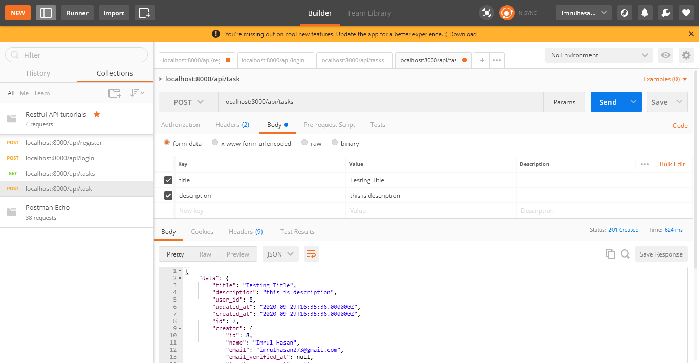

> Task Inserted

Output in Json format

```json
{
    "data": {
        "title": "Testing Title",
        "description": "this is description",
        "user_id": 8,
        "updated_at": "2020-09-29T16:35:36.000000Z",
        "created_at": "2020-09-29T16:35:36.000000Z",
        "id": 7,
        "creator": {
            "id": 8,
            "name": "Imrul Hasan",
            "email": "imrulhasan273@gmail.com",
            "email_verified_at": null,
            "two_factor_secret": null,
            "two_factor_recovery_codes": null,
            "created_at": "2020-09-29T15:33:49.000000Z",
            "updated_at": "2020-09-29T15:33:49.000000Z"
        }
    }
}
```

---

## **Show Task**

`TaskController.php`

```php
public function show(Task $task)
{
    return new TaskResource($task->load('creator'));
}
```

## Postman Visualize


> We fetch individual task with `id`

---

## **Update Task**

`TaskController.php`

```php
    public function update(Request $request, Task $task)
    {
        $request->validate([
            'title' => 'required|max:255'
        ]);

        $task->update($request->all());

        return new TaskResource($task->load('creator'));
    }
```

## Postman Visualize

One thing about put request is we can not do using this form data, because form can not recognize the `put` request.


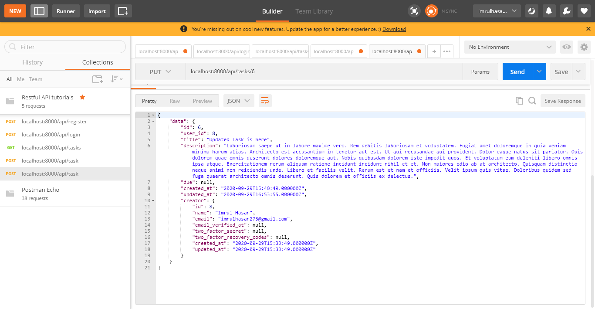

---

---

## **Delete Task**

`TaskController.php`

```php
    public function destroy(Task $task)
    {
        $task->delete();

        return response(['message' => 'Deleted']);
    }
```

## Postman Visualize

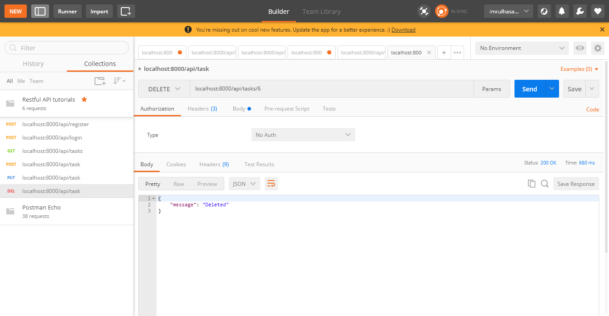

---

## Modify the Store Operation

`TaskController.php`

```php
    public function store(Request $request)
    {
        $request->validate([
            'title' => 'required|max:255'
        ]);

        $input = $request->all();

        if ($request->has('due')) {
            $input['due']  =  Carbon::parse($request->due)->toDateString();
        }

        $task = Auth::user()->tasks()->create($input);

        return new TaskResource($task->load('creator'));
    }
```

## Postman Visualize

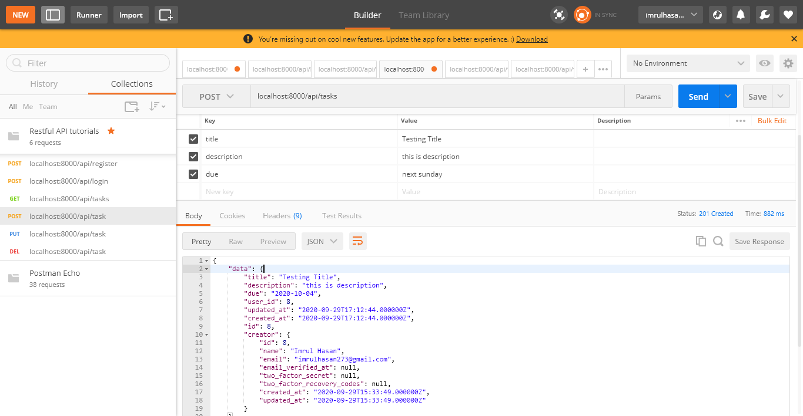

> Now date is also added.

---

## Modify the Update Operation

```php
    public function update(Request $request, Task $task)
    {
        $request->validate([
            'title' => 'required|max:255'
        ]);

        $input = $request->all();

        if ($request->has('due')) {
            $input['due']  =  Carbon::parse($request->due)->toDateString();
        }

        $task->update($input);

        return new TaskResource($task->load('creator'));
    }
```

## Postman Visualize

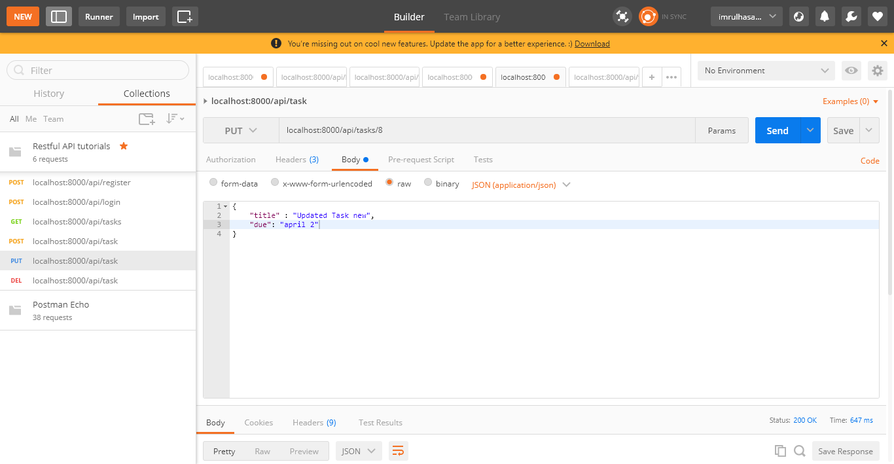

> Now date can also be updated.

---

---

# **Search using Rest API**

---

`api.php`

```php
Route::get('/tasks/search/{title}', [TaskController::class, 'search']);
```

`TaskController.php`

```php
public function search($title)
{
    $task =  Task::where('title', 'like', '%' . $title . '%')->get();

    return new TaskResource($task);
}
```

## Postman Visualize

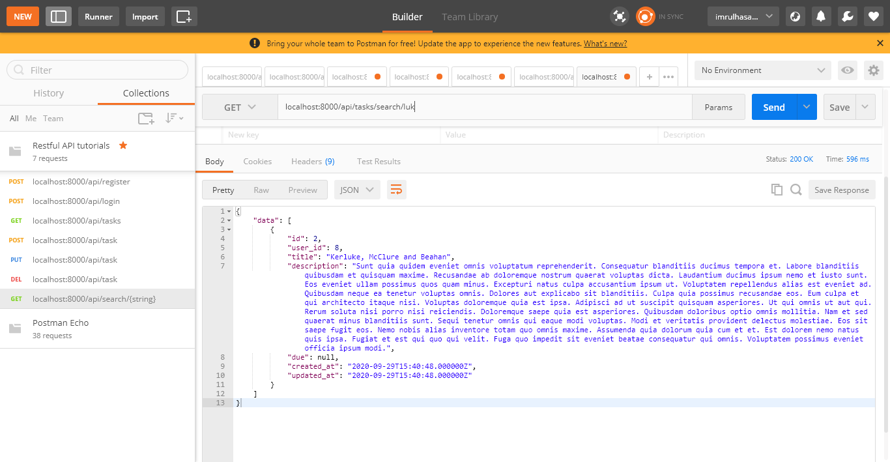

> Now Search Result Appears.

---

---

# **HTTP Clients**

---

Example dummy API data

[API DATA](https://reqres.in/api/users?page=1)

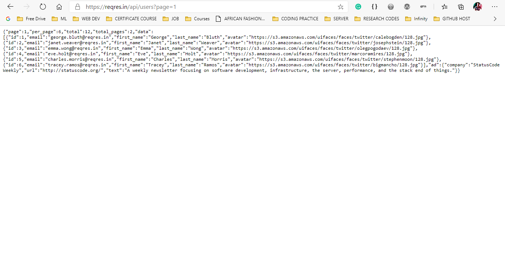

`web.php`

```php
Route::get('/users', [UserController::class, 'index'])->name('api.users.index');
```

`UserController.php`

```php
public function index()
{
    $users =  Http::get('https://reqres.in/api/users?page=1')['data'];

    return view('RestAPI.users', compact('users'));
}
```

`users.blade.php`

```php
@php
    $key=0;
@endphp
@extends('layouts.front')
@section('content')
<h1 style="margin-left:45%; margin-top: 5px;">Rest API</h1>
    <div style="padding-top: 5%;" class="container">
        <div class="row">

            <div >

                @if(count($errors)>0)
                    @foreach ($errors->all() as $error)
                        <p class="alert alert-danger">{{ $error }}</p>
                    @endforeach
                @endif

                <div>
                    <table class="table">
                        <thead class="thead-dark">
                          <tr>
                            <th scope="col">SL</th>
                            <th scope="col">ID</th>
                            <th scope="col">Email</th>
                            <th scope="col">First Name</th>
                            <th scope="col">Last Name</th>
                            <th scope="col">Photo</th>
                          </tr>
                        </thead>
                        <tbody>
                        @foreach ($users as $user)
                          <tr>
                            <th scope="row">{{ ++$key }}</th>
                            <td>{{$user['id']}}</td>
                            <td>{{$user['email']}}</td>
                            <td>{{$user['first_name']}}</td>
                            <td>{{$user['last_name']}}</td>
                            <td>{{$user['avatar']}}</td>
                          </tr>
                        @endforeach
                        </tbody>
                      </table>
                </div>

                <br/>

            </div>
        </div>
    </div>
@endsection

```

## Output

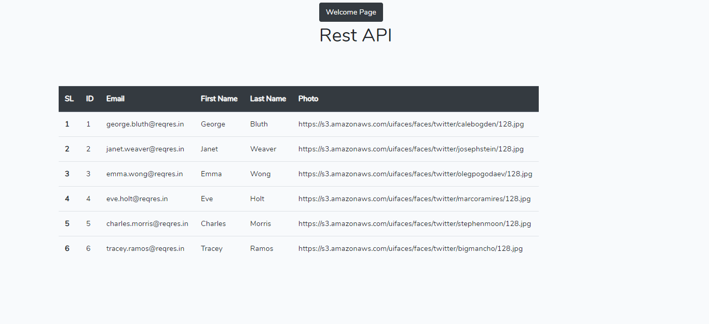

---

---
