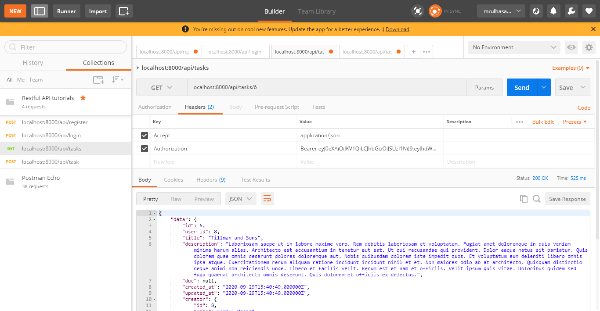

# UI

```cmd
~$ composer require laravel/fortify
```

```cmd
~$ php artisan vendor:publish --provider="Laravel\Fortify\FortifyServiceProvider"
```

```cmd
~$ php artisan migrate
```

Add below code to `app.php` in `Application Service Providers` array

```php
App\Providers\FortifyServiceProvider::class,
```

Add below code inside `boot()` function in `FortifyServiceProvider.php`.

```php
        Fortify::loginView(function () {
            return view('auth.login');
        });

        Fortify::registerView(function () {
            return view('auth.register');
        });

        Fortify::requestPasswordResetLinkView(function () {
            return view('auth.passwords.email');
        });

        Fortify::resetPasswordView(function ($request) {
            return view('auth.passwords.reset', ['request' => $request]);
        });
```

Copy Past Bootstrap `Views` files from other project to `Fortify` projects `views`

Create the below route

```php
Route::view('home', 'home')->middleware('auth');
```

---

---

# Log In with Username instead of Email

> [Link](https://www.tutsplanet.com/laravel-auth-login-with-username-instead-of-email)

# **Advanced Laravel**

---

# **Form Request Validation #1**

---

## Inefficient Way

`form.blade.php`

```php
<div class="col-lg-offset-4 col-lg-6">

    @if(count($errors)>0)
        @foreach ($errors->all() as $error)
            <p class="alert alert-danger">{{ $error }}</p>
        @endforeach
    @endif

    <form  method="post" action="{{ route('form.store') }}" enctype="multipart/form-data">
        @csrf
        <div class="form-group">
            <input class="form-control" type="text" name="name" placeholder="Name"/>
        </div>
        <div class="form-group">
            <input class="form-control" type="text" name="email" placeholder="Email"/>
        </div>
        <button class="btn btn-success" type="submit" name="submit">Submit</button>

    </form>
    <br/>

</div>
```

`web.php`

```php
Route::get('/form', [FormController::class, 'index'])->name('form.index');
Route::post('/form/store', [FormController::class, 'store'])->name('form.store');
```

`FormController.php`

```php
public function store(Request $request)
{
    $this->validate(
        $request,
        [
            'name' => 'required|max:20',
            'email' => 'required|max:40',
        ]
    );
}
```

## Efficiant Way

Create Request validation

```cmd
~$ php artisan make:request StoreFormValidation
```

`StoreFormValidation.php`

```php
<?php

namespace App\Http\Requests;

use Illuminate\Foundation\Http\FormRequest;

class StoreFormValidation extends FormRequest
{
    /**
     * Determine if the user is authorized to make this request.
     *
     * @return bool
     */
    public function authorize()
    {
        return true;
    }

    /**
     * Get the validation rules that apply to the request.
     *
     * @return array
     */
    public function rules()
    {
        return [
            'name' => 'required|max:20',
            'email' => 'required|max:40',
        ];
    }

    public function messages()
    {
        return [
            'name.required' => 'Please input a Name',
            'name.max' => 'Name should not more than 20 charecters',
            'email.required' => 'Please input an Email',
            'email.max' => 'Email should not more than 40 charecters',
        ];
    }
}

```

> `return true` for `authorize` function.

`FormController.php`

```php
public function store(StoreFormValidation $request)
{
    //
}
```

## Output


---

# **Rest API**

---

## Configuarations

```cmd
~$ php artisan make:model Task -mf
~$ php artisan make:controller Api/TaskController -r
```

Install Laravel Passport

```cmd
~$ composer require laravel/passport
~$ php artisan migrate
~$ php artisan passport:install
```

`User.php`

```php
class User extends Authenticatable
{
    use HasApiTokens;
}
```

`AuthServiceProvider.php`

```php
public function boot()
{
    $this->registerPolicies();
    Passport::routes(); //added
}
```

`config/auth.php`

```php
'api' => [
        'driver' => 'passport',
        'provider' => 'users',
        'hash' => false,
    ],
```

```cmd
~$ php artisan make:controller Api/AuthController -r
```

---

# **Registration using API**

---

`AuthController.php`

```php
    public function register(Request $request)
    {
        $validatedData = $request->validate([
            'name' => 'required|max:55',
            'email' => 'required|unique:users',
            'password' => 'required|confirmed'
        ]);

        $validatedData['password'] = Hash::make($request->password);

        $user = User::create($validatedData);

        $accessToken = $user->createToken('authToken')->accessToken;

        return response(['user' => $user, 'access_token' => $accessToken]);
    }
```

`api.php`

```php
Route::post('/register', [AuthController::class, 'register']);
```

## Postman Visualize

Settings for the registration


After Send POST Request


> User insertion successfull

If password does not match.


> Validation message.


> Validation error message that shows email should be unique

---

---

# **Login using API**

---

`api.php`

```php
Route::post('/login', [AuthController::class, 'login']);
```

`AuthController.php`

```php
    public function login(Request $request)
    {
        $LoginData = $request->validate([
            'email' => 'required',
            'password' => 'required '
        ]);

        if (!Auth::attempt($LoginData)) {
            return response(['message' => 'Invalid Credentials']);
        }

        $accessToken = Auth::user()->createToken('authToken')->accessToken;
        return response(['user' => Auth::user(), 'access_token' => $accessToken]);
    }
```

## Postman Visualize

Settings for the login


After Sending Post Request


---

---

# **Task CRUD using API**

---

```cmd
~$ php artisan passport:install

```

`TaskFactory.php`

```php
    public function definition()
    {
        return [
            'title' => $this->faker->company,
            'description' => $this->faker->paragraph(20),
            'user_id' => '8' //Make sure this user id exists.
        ];
    }
```

Now run the Seeder [We don't use DataBase Seeder now.]

```cmd
~$ php artisan tinker
~$ App\Models\Task::factory(5)->create()
```

## Data Fetching (Read Operation)

`api.php`

```php
Route::apiResource('/tasks', TaskController::class);
// Route::get('/tasks', [TaskController::class, 'index']);
```

`TaskController.php`

```php
public function index()
{
    return Task::all();
}
```

---

## Postman Visualize


> We can get all the tasks

> But this is not good way to retrive data using index function in TaskController.

---

## Good Approach

```cmd
~$ php artisan make:resource TaskResource
```

`api.php`

```php
Route::apiResource('/tasks', TaskController::class)->middleware('auth:api');
```

`Task.php`

```php
class Task extends Model
{
    use HasFactory;

    protected $guarded = ['user_id'];

    public function creator()
    {
        return $this->belongsTo(User::class, 'user_id', 'id');
    }
}
```

`User.php`

```php
public function tasks()
{
    return $this->hasMany(Task::class);
}
```

`TaskController.php`

```php
public function index()
{
    return TaskResource::collection(Auth::user()->tasks()->with('creator')->latest()->paginate(4));
}
```

-   Now first Login from postman visualizer.
-   Get the access token from login information in `localhost:8000/api/login`
-   put the token to header in `Authorization` key in `localhost:8000/api/tasks`

> Login Now


> Now SEND a GET Request


> We can see after log in all the tasks belongs to the auth user are retrives here.

Output in JSON formate

```json
{
    "data": [
        {
            "id": 3,
            "user_id": 8,
            "title": "Simonis Inc",
            "description": "Eos error tempora neque at molestiae. Voluptate sint ut repellendus ut qui ipsum assumenda. Rerum autem consequuntur reprehenderit et quo quos. Et voluptatem animi et. Voluptas consequuntur porro facilis. Dolorum ut sit harum. Non praesentium consequuntur vel quod non voluptatibus nihil temporibus. Qui repellendus quos nam distinctio rerum. Exercitationem corporis quis vitae velit modi rerum. Aut voluptate consequatur harum omnis magni repellat. Aut non corrupti sed id natus. Et placeat blanditiis aspernatur aut quisquam maxime. Qui dolorem saepe optio possimus et qui suscipit. Non ab et non non aliquid. Et maiores et consequatur commodi est. Quam quidem velit incidunt. Et sapiente et error. Commodi totam asperiores nobis earum.",
            "due": null,
            "created_at": "2020-09-29T15:40:49.000000Z",
            "updated_at": "2020-09-29T15:40:49.000000Z",
            "creator": {
                "id": 8,
                "name": "Imrul Hasan",
                "email": "imrulhasan273@gmail.com",
                "email_verified_at": null,
                "two_factor_secret": null,
                "two_factor_recovery_codes": null,
                "created_at": "2020-09-29T15:33:49.000000Z",
                "updated_at": "2020-09-29T15:33:49.000000Z"
            }
        },
        {
            "id": 4,
            "user_id": 8,
            "title": "Mosciski, Stracke and Rolfson",
            "description": "Rerum molestiae eos velit perferendis magnam tempore tempora. Similique eos esse sit dignissimos rerum doloribus nihil. Repellendus sunt repudiandae sed vero qui minus. Perferendis officia est voluptatibus consequatur expedita. Cum ea qui ipsa sed. Dolor aut aspernatur perspiciatis consectetur architecto voluptatibus. Incidunt harum explicabo et. Incidunt in soluta aut nesciunt. Quis libero recusandae ut deleniti. Nisi placeat placeat pariatur. Assumenda mollitia maxime excepturi dolorum dolore ipsam veritatis. Ex optio consectetur molestiae placeat ipsam nihil distinctio. Sunt aperiam deserunt rerum. Qui dolores sint consequatur quas sint facilis. Consequatur quia qui est in debitis. Odit ut consequatur reprehenderit accusantium officiis sapiente totam. Consequuntur eligendi dolorem iusto beatae rerum unde. Ut voluptatum expedita qui eligendi ea amet corporis sed. Ut ea expedita ducimus aut. Consectetur sit nesciunt ea inventore qui quidem. Et sint repellat est omnis placeat et nobis quos. Et in error ad dolor non. Ipsa autem quidem sequi perferendis ut laudantium. Quaerat quod dolore assumenda. Aut dolor asperiores facilis occaecati ex magnam. Voluptatem maxime nulla recusandae ullam cupiditate.",
            "due": null,
            "created_at": "2020-09-29T15:40:49.000000Z",
            "updated_at": "2020-09-29T15:40:49.000000Z",
            "creator": {
                "id": 8,
                "name": "Imrul Hasan",
                "email": "imrulhasan273@gmail.com",
                "email_verified_at": null,
                "two_factor_secret": null,
                "two_factor_recovery_codes": null,
                "created_at": "2020-09-29T15:33:49.000000Z",
                "updated_at": "2020-09-29T15:33:49.000000Z"
            }
        },
        {
            "id": 5,
            "user_id": 8,
            "title": "Harber-Cummings",
            "description": "Est et et quo hic. Delectus tempore animi voluptas et vel magni nam. Quo sint laudantium aliquid vel aut. Deserunt nostrum exercitationem atque perferendis non sit libero. Officia neque quod et autem. Tenetur asperiores labore voluptatum dolores sit qui alias. Culpa neque et veniam. Est voluptatem suscipit harum omnis et id. Ad non ut est fugiat voluptas ut consectetur et. Vel est alias id. Dolores aut ab et culpa iste blanditiis voluptates quia. Rerum doloremque veniam recusandae nihil. Illo provident eum numquam voluptatem eveniet. Error rerum saepe excepturi suscipit quia et. Consectetur unde perspiciatis maxime perferendis. Qui enim dolores dolorum. Quisquam est sint rerum quas. Voluptate placeat omnis cupiditate enim quia amet. Sed eos ratione qui numquam deserunt ullam enim. Fugit quis accusantium officia iste doloremque nobis.",
            "due": null,
            "created_at": "2020-09-29T15:40:49.000000Z",
            "updated_at": "2020-09-29T15:40:49.000000Z",
            "creator": {
                "id": 8,
                "name": "Imrul Hasan",
                "email": "imrulhasan273@gmail.com",
                "email_verified_at": null,
                "two_factor_secret": null,
                "two_factor_recovery_codes": null,
                "created_at": "2020-09-29T15:33:49.000000Z",
                "updated_at": "2020-09-29T15:33:49.000000Z"
            }
        },
        {
            "id": 6,
            "user_id": 8,
            "title": "Tillman and Sons",
            "description": "Laboriosam saepe ut in labore maxime vero. Rem debitis laboriosam et voluptatem. Fugiat amet doloremque in quia veniam minima harum alias. Architecto est accusantium in tenetur aut est. Ut qui recusandae qui provident. Dolor eaque natus sit pariatur. Quis dolorem quae omnis deserunt dolores doloremque aut. Nobis quibusdam dolorem iste impedit quos. Et voluptatum eum deleniti libero omnis ipsa atque. Exercitationem rerum aliquam ratione incidunt incidunt nihil et et. Non maiores odio ab at architecto. Quisquam distinctio neque animi non reiciendis unde. Libero et facilis velit. Rerum est et nam et officiis. Velit ipsum quis vitae. Doloribus quidem sed fuga quaerat architecto omnis deserunt. Quis dolorem et officiis ex delectus.",
            "due": null,
            "created_at": "2020-09-29T15:40:49.000000Z",
            "updated_at": "2020-09-29T15:40:49.000000Z",
            "creator": {
                "id": 8,
                "name": "Imrul Hasan",
                "email": "imrulhasan273@gmail.com",
                "email_verified_at": null,
                "two_factor_secret": null,
                "two_factor_recovery_codes": null,
                "created_at": "2020-09-29T15:33:49.000000Z",
                "updated_at": "2020-09-29T15:33:49.000000Z"
            }
        }
    ],
    "links": {
        "first": "http://localhost:8000/api/tasks?page=1",
        "last": "http://localhost:8000/api/tasks?page=2",
        "prev": null,
        "next": "http://localhost:8000/api/tasks?page=2"
    },
    "meta": {
        "current_page": 1,
        "from": 1,
        "last_page": 2,
        "links": [
            {
                "url": null,
                "label": "Previous",
                "active": false
            },
            {
                "url": "http://localhost:8000/api/tasks?page=1",
                "label": 1,
                "active": true
            },
            {
                "url": "http://localhost:8000/api/tasks?page=2",
                "label": 2,
                "active": false
            },
            {
                "url": "http://localhost:8000/api/tasks?page=2",
                "label": "Next",
                "active": false
            }
        ],
        "path": "http://localhost:8000/api/tasks",
        "per_page": 4,
        "to": 4,
        "total": 5
    }
}
```

---

## Data Store (Create Operation)

`TaskController.php`

```php
    public function store(Request $request)
    {
        $request->validate([
            'title' => 'required|max:255'
        ]);

        $task = Auth::user()->tasks()->create($request->all());

        return new TaskResource($task->load('creator'));
    }
```

## Postman Visulize

Sending a POST Request


> Task Inserted

Output in Json format

```json
{
    "data": {
        "title": "Testing Title",
        "description": "this is description",
        "user_id": 8,
        "updated_at": "2020-09-29T16:35:36.000000Z",
        "created_at": "2020-09-29T16:35:36.000000Z",
        "id": 7,
        "creator": {
            "id": 8,
            "name": "Imrul Hasan",
            "email": "imrulhasan273@gmail.com",
            "email_verified_at": null,
            "two_factor_secret": null,
            "two_factor_recovery_codes": null,
            "created_at": "2020-09-29T15:33:49.000000Z",
            "updated_at": "2020-09-29T15:33:49.000000Z"
        }
    }
}
```

---

## **Show Task**

`TaskController.php`

```php
public function show(Task $task)
{
    return new TaskResource($task->load('creator'));
}
```

## Postman Visualize



> We fetch individual task with `id`

---

## **Update Task**

`TaskController.php`

```php
    public function update(Request $request, Task $task)
    {
        $request->validate([
            'title' => 'required|max:255'
        ]);

        $task->update($request->all());

        return new TaskResource($task->load('creator'));
    }
```

## Postman Visualize

One thing about put request is we can not do using this form data, because form can not recognize the `put` request.


---

---

## **Delete Task**

`TaskController.php`

```php
    public function destroy(Task $task)
    {
        $task->delete();

        return response(['message' => 'Deleted']);
    }
```

## Postman Visualize


---

## Modify the Store Operation

`TaskController.php`

```php
    public function store(Request $request)
    {
        $request->validate([
            'title' => 'required|max:255'
        ]);

        $input = $request->all();

        if ($request->has('due')) {
            $input['due']  =  Carbon::parse($request->due)->toDateString();
        }

        $task = Auth::user()->tasks()->create($input);

        return new TaskResource($task->load('creator'));
    }
```

## Postman Visualize


> Now date is also added.

---

## Modify the Update Operation

```php
    public function update(Request $request, Task $task)
    {
        $request->validate([
            'title' => 'required|max:255'
        ]);

        $input = $request->all();

        if ($request->has('due')) {
            $input['due']  =  Carbon::parse($request->due)->toDateString();
        }

        $task->update($input);

        return new TaskResource($task->load('creator'));
    }
```

## Postman Visualize


> Now date can also be updated.

---

---

# **Search using Rest API**

---

`api.php`

```php
Route::get('/tasks/search/{title}', [TaskController::class, 'search']);
```

`TaskController.php`

```php
public function search($title)
{
    $task =  Task::where('title', 'like', '%' . $title . '%')->get();

    return new TaskResource($task);
}
```

## Postman Visualize


> Now Search Result Appears.

---

---

# **HTTP Clients**

---

Example dummy API data

[API DATA](https://reqres.in/api/users?page=1)


`web.php`

```php
Route::get('/users', [UserController::class, 'index'])->name('api.users.index');
```

`UserController.php`

```php
public function index()
{
    $users =  Http::get('https://reqres.in/api/users?page=1')['data'];

    return view('RestAPI.users', compact('users'));
}
```

`users.blade.php`

```php
@php
    $key=0;
@endphp
@extends('layouts.front')
@section('content')
<h1 style="margin-left:45%; margin-top: 5px;">Rest API</h1>
    <div style="padding-top: 5%;" class="container">
        <div class="row">

            <div >

                @if(count($errors)>0)
                    @foreach ($errors->all() as $error)
                        <p class="alert alert-danger">{{ $error }}</p>
                    @endforeach
                @endif

                <div>
                    <table class="table">
                        <thead class="thead-dark">
                          <tr>
                            <th scope="col">SL</th>
                            <th scope="col">ID</th>
                            <th scope="col">Email</th>
                            <th scope="col">First Name</th>
                            <th scope="col">Last Name</th>
                            <th scope="col">Photo</th>
                          </tr>
                        </thead>
                        <tbody>
                        @foreach ($users as $user)
                          <tr>
                            <th scope="row">{{ ++$key }}</th>
                            <td>{{$user['id']}}</td>
                            <td>{{$user['email']}}</td>
                            <td>{{$user['first_name']}}</td>
                            <td>{{$user['last_name']}}</td>
                            <td>{{$user['avatar']}}</td>
                          </tr>
                        @endforeach
                        </tbody>
                      </table>
                </div>

                <br/>

            </div>
        </div>
    </div>
@endsection

```

## Output


---

---

# **Laravel Session**

---

`web.php`

```php

# Login page appears if he is not loggin in.
Route::get('/session/login', function () {
    if (session()->has('name')) {
        return view('session.profile');
    }
    return view('/session/login');
})->name('session.login');


# Route for Profile Page
Route::post('/session/profile', [SessionController::class, 'userLogin'])->name('session.login.submit');

# Route for Logout
Route::get('/logout', function () {
    if (session()->has('name')) {
        session()->pull('name');
    }
    return Redirect::route('session.login');
});
```

`SessionController.php`

```php
    public function userLogin(Request $request)
    {
        $data = $request->input();
        $request->session()->put('name', $data['name']);

        return view('session.profile');
    }
```

> set a `key` with name `name` for **session** and set the value of `name` key to value of `$data['name]`.

`login.blade.php`

```php
<form  method="post" action="{{ route('session.login.submit') }}" enctype="multipart/form-data">
    @csrf
    <div class="form-group">
        <input class="form-control" type="name" name="name" placeholder="Name"/>
    </div>
    <div class="form-group">
        <input class="form-control" type="password" name="password" placeholder="Password"/>
    </div>
    <button class="btn btn-success" type="submit" name="submit">Submit</button>
</form>
```

`profile.blade.php`

```php
<div class="row">
    <div >

        <div>
        <h1>Hello, {{ session('name') }}</h1>
        </div>


        <a href="/logout" type="a" class="btn btn-light">Log Out</a>

        <br/>

    </div>
</div>
```

---

---

---

# **Service Container**

---

Create a new controller

```cmd
~$ php artisan make:controller PayOrderController
```

`PayOrderController.php`

```php
namespace App\Http\Controllers;

use App\Billing\PaymentGateway;
use Illuminate\Http\Request;

class PayOrderController extends Controller
{
    # code ...
}
```

-   Create a new Directory named `Billing` inside `app` dir.
-   Create a new class `PaymentGateway.php` file inside `Billing` dir.

`PaymentGateway.php`

```php
<?php

namespace App\Billing;

class PaymentGateway
{
    //
}

```

## Gateway

Create a store function on it.

`PaymentGateway.php`

```php
<?php
class PaymentGateway
{
    public function charge($amount)
    {
        return [
            'amount' => $amount,
            'confirmation_number' => Str::random(),
        ]
    }
}
```

## Route

`web.php`

```php
Route::get('/pay', [PayOrderController::class, 'store'])->name('pay.order');
```

## Store Function in PayOrderController

`PayOrderController`

```php
<?php
class PayOrderController extends Controller
{
    public function store()
    {
        $paymentGateway = new PaymentGateway();
        dd($paymentGateway->charge(2500));
    }
}
```

### Output

```php
array:2 [▼
  "amount" => 2500
  "confirmation_number" => "ciOkFxrvCTHQtTaX"
]
```

-   we can get rid of this `$paymentGateway = new PaymentGateway();` line al together. We can ask Laravel to go ahead and inject this for us.
-   Laravel gonna use the `reflection` class. And the basics behind the reflection is that, if you asked somebody to descriibe themselves they would not be able to unless they had a mirror or a reflection of themselves. They could looking at themselves and they could tell you about themselves. SO if they don't have `reflection` they won't know how they look like.

-   Same thing for object. It takes an object and it puts a mirror in front of it so that it can reflect on itself. And conceptually speaking it can tell you a lot about itself.

## Updated Store Function in PayOrderController

`PayOrderController.php`

```php
class PayOrderController extends Controller
{
    public function store(PaymentGateway $paymentGateway)
    {
        dd($paymentGateway->charge(2500));
    }
}
```

### Output

```php
array:2 [▼
  "amount" => 2500
  "confirmation_number" => "yU7syFc26QAbbueW"
]
```

---

-   What if we need to pass something into `PaymentGateway()` as parameter?

`PaymentGateway.php`

```php
class PaymentGateway
{
    private $currency;

    public function __construct($currency)
    {
        $this->currency = $currency;
    }

    public function charge($amount)
    {
        return [
            'amount' => $amount,
            'confirmation_number' => Str::random(),
            'currency' => $this->currency,
        ];
    }
}
```

`PayOrderController.php`

```php
class PayOrderController extends Controller
{
    public function store()
    {
        $paymentGateway = new PaymentGateway('USD');

        dd($paymentGateway->charge(2500));
    }
}
```

### Outputs

```php
array:3 [▼
  "amount" => 2500
  "confirmation_number" => "vgj9p0grClpRLCNr"
  "currency" => "USD"
]
```

---

-   Now how to use `relfection` class with get rid of `$paymentGateway = new PaymentGateway('USD');` in **PayOrderController**.

-   There is no way to use `reflection` direcly.

If we use like below code now...

```php
class PayOrderController extends Controller
{
    public function store(PaymentGateway $paymentGateway)
    {
        dd($paymentGateway->charge(2500));
    }
}
```

-   Notice we have no way to pass parameter with it.

### Outputs

> `Illuminate\Contracts\Container\BindingResolutionException Unresolvable dependency resolving [Parameter #0 [ <required> $currency ]] in class App\Billing\PaymentGateway`

-   This is `BindingResolutionException`. Unable to give dependency that I am asking for.
-   It requires the `currency` parameter.
-   So what is the solution?
-   How do we fix that?

## Solution :-> **Service Provider**

-   if we go into `app/providers` there is an `AppServiceProvider`.
-   `AppServiceProvider` is where your application bootstraps itself of anything that it needs.
-   In `register()` method.

`AppServiceProvider.php`

```php
public function register()
{
    $this->app->bind(PaymentGateway::class, function ($app) {
        return new PaymentGateway('USD');
    });
}
```

### Outputs

```php
array:3 [▼
  "amount" => 2500
  "confirmation_number" => "1jwo6C7mxcrc24df"
  "currency" => "USD"
]
```

---

-   So if we have 50 Controller, we don't need to change `usd`. We just can change inside `service provider`.

## Discount into PaymentGateway

-   Create a new Directory named `Orders` inside `app` dir.
-   Create a new class `OrderDetails.php` file inside `Orders` dir.

`OrderDetails.php`

```php
<?php

namespace App\Orders;

class OrderDetails
{
    # code...
}

```

---

## **Fanally All the files.....**

`PaymentGateway.php`

```php
<?php

namespace App\Billing;

use Illuminate\Support\Str;

class PaymentGateway
{
    private $currency;
    private $discount;

    public function __construct($currency)
    {
        $this->currency = $currency;
        $this->discount = 0;
    }

    public function setDiscount($amount)
    {
        $this->discount = $amount;
    }

    public function charge($amount)
    {
        return [
            'amount' => $amount - $this->discount,
            'discount' => $this->discount,
            'confirmation_number' => Str::random(),
            'currency' => $this->currency,
        ];
    }
}
```

`OrderDetails.php`

```php
<?php

namespace App\Orders;

use App\Billing\PaymentGateway;

class OrderDetails
{
    private $paymentGateway;
    public function __construct(PaymentGateway $paymentGateway)
    {
        $this->paymentGateway = $paymentGateway;
    }

    public function all()
    {
        $this->paymentGateway->setDiscount(500);

        return [
            'name' => 'Imrul',
            'address' => 'Savar, Dhaka'
        ];
    }
}
```

`PayOrderController.php`

```php
<?php

namespace App\Http\Controllers;

use App\Billing\PaymentGateway;
use App\Orders\OrderDetails;
use Illuminate\Http\Request;

class PayOrderController extends Controller
{
    public function store(OrderDetails $orderDetails, PaymentGateway $paymentGateway)
    {
        $order = $orderDetails->all();
        dd($paymentGateway->charge(2500));
    }
}
```

`AppServiceProvider.php`

```php
public function register()
{
    $this->app->bind(PaymentGateway::class, function ($app) {
        return new PaymentGateway('USD');
    });
}
```

### Outputs

```php
array:4 [▼
  "amount" => 2500
  "discount" => 0
  "confirmation_number" => "wmaAGtvfHD8qU5hm"
  "currency" => "USD"
]
```

> We can see that discount is not executed.

Do some changes in Service Provider

`AppServiceProvider.php`

```php
public function register()
{
    $this->app->singleton(PaymentGateway::class, function ($app) {
        return new PaymentGateway('USD');
    });
}
```

### Outpus

```php
array:4 [▼
  "amount" => 2000
  "discount" => 500
  "confirmation_number" => "yBQEM6fBgaPtfGvf"
  "currency" => "USD"
]
```

> Now discount executed.

## Reason

-   Use bind for **reusable** classes or objects - **the object is constructed each time it is called**. If you need multiple instances of a class, use bind

-   Use singleton for a class or object that you need access to throughout the application - the **object is only constructed once** and so retains state throughout execution. If you only need a single, shared, instance of a class, use singleton

## Flow

-   Inside `PayOrderController` When `OrderDetails` gets created it request a `PaymentGateway`.
-   Laravel Going to look inside the `Container` to find a `PaymentGateway`
-   Inside `Container`, it finds the `PaymentGateway` and right here we have instructed a **callback** function to tell the laravel how to actually make up a `PaymentGateway`. So it will actually **invoke** this function and save the results.
-   Then it will pass them into my `OrderDetails`
-   Now Again inside `PayOrderController` when 2nd parameter which is `PaymentGateway`.
-   SO it goes back into the `Container` and says wait a minute, I have already got one of those. So it doesn't run this instead it return the results of the first time that this was invoked.
-   Then it passes in `PaymentGateway`

---

-   What if I have a Bank Payment and may be a Credit Card Processing Company.
-   How do I choose one of those two dynamically?
-   Edit the class to `BankPaymentGateway` from `PaymentGateway`

Create a new **interface** file inside `app/Billing` dir named `PaymentgatewayContract`.

`PaymentGatewayContract.php`

```php
<?php

namespace App\Billing;

interface PaymentGatewayContract
{
    public function setDiscount($amount);

    public function charge($amount);
}
```

# **FINALLY - - SERVICE PROVIDER | CONTAINER**

`BankPaymentGateway.php`

```php
<?php

namespace App\Billing;

use Illuminate\Support\Str;

class BankPaymentGateway implements PaymentGatewayContract
{
    private $currency;
    private $discount;


    public function __construct($currency)
    {
        $this->currency = $currency;
        $this->discount = 0;
    }

    public function setDiscount($amount)
    {
        $this->discount = $amount;
    }

    public function charge($amount)
    {
        return [
            'amount' => $amount - $this->discount,
            'discount' => $this->discount,
            'confirmation_number' => Str::random(),
            'currency' => $this->currency,
        ];
    }
}
```

`CreditPaymentGateway.php`

```php
<?php

namespace App\Billing;

use Illuminate\Support\Str;

class CreditPaymentGateway implements PaymentGatewayContract
{
    private $currency;
    private $discount;


    public function __construct($currency)
    {
        $this->currency = $currency;
        $this->discount = 0;
    }

    public function setDiscount($amount)
    {
        $this->discount = $amount;
    }

    public function charge($amount)
    {
        $fees =  $amount * 0.03;
        return [
            'amount' => $amount - $this->discount + $fees,
            'discount' => $this->discount,
            'confirmation_number' => Str::random(),
            'currency' => $this->currency,
            'fees' => $fees,
        ];
    }
}
```

`PaymentGatewayContract.php`

```php
<?php

namespace App\Billing;

interface PaymentGatewayContract
{
    public function setDiscount($amount);

    public function charge($amount);
}
```

`OrderDetails.php`

```php
<?php

namespace App\Orders;

use App\Billing\PaymentGatewayContract;

class OrderDetails
{
    private $PaymentGateway;
    public function __construct(PaymentGatewayContract $PaymentGateway)
    {
        $this->PaymentGateway = $PaymentGateway;
    }

    public function all()
    {
        $this->PaymentGateway->setDiscount(500);

        return [
            'name' => 'Imrul',
            'address' => 'Savar, Dhaka'
        ];
    }
}
```

`PayOrderController.php`

```php
<?php

namespace App\Http\Controllers;

use App\Billing\PaymentGatewayContract;
use App\Orders\OrderDetails;

class PayOrderController extends Controller
{
    public function store(OrderDetails $orderDetails, PaymentGatewayContract $PaymentGateway)
    {
        $order = $orderDetails->all();
        dd($PaymentGateway->charge(2500));
    }
}
```

`AppServiceProvider.php`

```php
public function register()
{
    $this->app->singleton(PaymentGatewayContract::class, function ($app) {
        if ($_REQUEST['payment'] == "bank") {
            return new BankPaymentGateway('USD');
        } else if($_REQUEST['payment'] == "credit") {
            return new CreditPaymentGateway('USD');
        }
    });
}
```

`web.php`

```php
Route::post('/service-provider/pay', [PayOrderController::class, 'store'])->name('pay.order');
```

FrontEnd

`index.blade.php`

```php
<form  method="post" action="{{route('pay.order')}}" enctype="multipart/form-data">
    @csrf
    <div class="form-group">
        <label for="exampleFormControlSelect1">Example select</label>
        <select name="payment" class="form-control" id="exampleFormControlSelect1">
          <option value="bank">Bank Payment</option>
          <option value="credit">Credit Payament</option>
        </select>
      </div>
    <button class="btn btn-success" type="submit" name="submit">Submit</button>
</form>
```

### Select Bank Payment Gateway


## Output


### Select Credit Payment Gateway


## Output


---

---

# **View Composers**

---

```cmd
~$ php artisan make:model Channel -fmc
```

Add some data in factory.

`ChannelFactory.php`

```php
public function definition()
{
    return [
        'name' => $this->faker->word,
    ];
}
```

```cmd
~$ php artisan tinker
~$ App\Models\Channel::factory(20)->create()
```

`web.php`

```php
Route::get('/channels', [ChannelController::class, 'index'])->name('channed.index');
```

`ChannelController.php`

```php
public function index()
{
    $channels = Channel::all();
    return view('view_composer.channel.index', compact('channels'));
}
```

`index.blade.php`

```php
<table class="table">
    <thead class="thead-dark">
      <tr>
        <th scope="col">ID</th>
        <th scope="col">Name</th>
      </tr>
    </thead>
    <tbody>
    @foreach ($channels as $channel)
      <tr>
        <td>{{$channel->id}}</td>
        <td>{{$channel->name}}</td>
      </tr>
    @endforeach
    </tbody>
</table>
```

> We can now view all the `channel name` with `id` inside the `view`.

## New Concept of Posts

```cmd
~$ php artisan make:controller PostController
```

`web.php`

```php
Route::get('/post/create', [PostController::class, 'create'])->name('post.create');
```

`PostController.php`

```php
public function create()
{
    $channels = Channel::all();

    return view('view_composer.post.create', compact('channels'));
}
```

`create.blade.php`

```php
<form action="">
    <select name="channel_id" id="channel_id">
        @foreach ($channels as $channel)
            <option value="{{$channel->id}}">{{$channel->name}}</option>
        @endforeach
    </select>
</form>
```

-   Suppose somebody wants this channel list in alphabetical order for all `views`

`PostController.php`

```php
public function create()
{
    # $channels = Channel::all();
    $channels = Channel::orderBy('name')->get();    //alphabetical Order
    return view('view_composer.post.create', compact('channels'));
}
```

`ChannelController.php`

```php
public function index()
{
    # $channels = Channel::all();
    $channels = Channel::orderBy('name')->get();
    return view('view_composer.channel.index', compact('channels'));
}
```

> So we can see that we need to change both two blade file to make the changes.

> So its so painful that just to make the channels in `alphabetical` order, we need to change those `views` where `channels` query is made. In this case we need to change `PostController` and in `ChannelController`.

## Solution --> **View Composer** or **View Share**

---

`ChannelController.php`

```php
public function index()
{
    return view('view_composer.channel.index');
}
```

`CreateController.php`

```php
public function create()
{
    return view('view_composer.post.create');
}
```

## Method 1 (Using `View Share` Method)

`AppServiceProvider.php`

```php
public function boot()
{
    View::share('channels', Channel::orderBy('name')->get());
}
```

-   Here `channels` is the global variable name and 2nd argument is the `Query`.
-   We can use this variable in whole project in all views.

### This Method is Best or Worst.

-   The boot method is called when every single view is render.
-   So that means for every single view the `Channel` query will be run.
-   So performance downgrading.
-   Also security issue as all the file will know this `variable`.

---

## Method 2 (Using `View Composer` Method)

-   def: We can attach a data to some views.

`AppServiceProvider.php`

```php
public function boot()
{
    View::composer(['view_composer.post.create', 'view_composer.channel.index'], function ($view) {
        $view->with('channels', Channel::orderBy('name')->get());
    });
}
```

> This method is also called as **Granular Views With Wildcards**

-   Supporse we want to share this `channel` with all the views inside the `post` directory.

```php
View::composer(['view_composer.post.*', 'view_composer.channel.index'], function ($view) {
    $view->with('channels', Channel::orderBy('name')->get());
});
```

> Using `.*` after `post` dir.

---

## Method 3 (View Composer Method with Clean Code)

Create a new File `app\Http\View\Composers\ChannelsComposer.php`

`ChannelsComposer.php`

```php
<?php

namespace App\Http\View\Composers;

use App\Models\Channel;
use Illuminate\View\View;

class ChannelsComposer
{
    public function compose(View $view)
    {
        $view->with('channels', Channel::orderBy('name')->get());
    }
}
```

> Notice this `View` is from `use Illuminate\View\View;`

`AppServiceProvider.php`

```php
namespace App\Providers;

use App\Models\Channel;
use Illuminate\Support\Facades\View;
use App\Http\View\Composers\ChannelsComposer;
use Illuminate\Support\ServiceProvider;
```

```php
public function boot()
{
    View::composer(['view_composer.post.create', 'view_composer.channel.index'], ChannelsComposer::class);
}
```

> Notice this `View` is from `use Illuminate\Support\Facades\View;`

---

---

# **Polymorphic Relationships**

---

```cmd
~$ php artisan make:model Post -fm
~$ php artisan make:model Image -m
```

`posts migration`

```php
Schema::create('posts', function (Blueprint $table) {
    $table->id();
    $table->string('title');
    $table->text('body');
    $table->timestamps();
});
```

`PostFactory.php`

```php
public function definition()
{
    return [
        'title' => $this->faker->sentence,
        'body' => $this->faker->paragraph,
    ];
}
```

-   `image` table is a table which is shared with `users` and `posts`.
-   So need to have two special columns inside the `images` table in order polymorphysm to work.
    -   the first column hold the `id` of item that it is associated to.
        -   if it is for post then column is `post_id`.
        -   `$table->unsignedBigInteger('post_id');` is not good idea to use
        -   when this is time for user. its not going to work.
        -   the `post_id` doen't exist in `users` table.
        -   So we need to find a sort of term that can apply to just about everything.

`images` table

```php
Schema::create('images', function (Blueprint $table) {
    $table->id();
    $table->string('url');
    $table->unsignedBigInteger('imageable_id');
    $table->string('imageable_type');
    $table->timestamps();
});
```

Go to TInker to run factory.

```cmd
~$ php artisan tinker
~$ App\Models\Post::factory(1)->create()
```

Set Up relationship

# Post - Image - User Concept [One to One Relationship]

`Post.php`

```php
class Post extends Model
{
    use HasFactory;
    protected $guarded = [];

    public function image()
    {
        return $this->morphOne(Image::class, 'imageable');
    }
}
```

`Image.php`

```php
class Image extends Model
{
    use HasFactory;
    protected $guarded = [];

    public function imageable()
    {
        return $this->morphTo();
    }
}
```

`User.php`

```php
public function image()
{
    return $this->morphOne(Image::class, 'imageable');
}
```

> Here we dont use `post` or `user`. Instead we use `imageable` as function name. Because this function will change between post and user.

## Tinker

### Query 1 [Post]

```php
$post = Post::first();
```

### Output

```php
App\Models\Post {#4295
     id: 1,
     title: "Commodi dolorem suscipit aut ullam repellendus natus.",
     body: "Veritatis molestiae sunt et vero blanditiis autem possimus sed. Aut asperiores aut officia est quaerat in reiciendis. Et aperiam ut assumenda nemo sit dolor id. Suscipit molestiae consequatur modi reiciendis voluptas rerum tenetur.",
     created_at: "2020-10-01 17:10:41",
     updated_at: "2020-10-01 17:10:41",
   }
```

### Query 2 [Post]

```php
$post->image()->create(['url'=>'some/image.jpg']);
```

### Output

```php
App\Models\Image {#4300
     url: "some/image.jpg",
     imageable_id: 1,
     imageable_type: "App\Models\Post",
     updated_at: "2020-10-01 17:21:37",
     created_at: "2020-10-01 17:21:37",
     id: 1,
   }
```

### Database [images]


-   Here we can see `imageable_id` is 1 of table `posts`. So this id belongs to the `Post` model.

## Tinker

### Query 1 [User]

```php
$user = User::first();
```

### Output

```php
App\Models\User {#4296
     id: 8,
     name: "Imrul Hasan",
     email: "imrulhasan273@gmail.com",
     email_verified_at: null,
     two_factor_secret: null,
     two_factor_recovery_codes: null,
     created_at: "2020-09-29 15:33:49",
     updated_at: "2020-09-29 15:33:49",
}
```

### Query 2 [User]

```php
$user->image()->create(['url'=>'profile.jpg']);
```

### Output

```php
App\Models\Image {#4300
     url: "profile.jpg",
     imageable_id: 8,
     imageable_type: "App\Models\User",
     updated_at: "2020-10-01 17:38:54",
     created_at: "2020-10-01 17:38:54",
     id: 3,
}
```

### Database [Image]


-   Here we can see `imageable_id` is 8 of table `users`. So this id belongs to the `User` model.
-   So this image can not belong to more than one `User`.

---

---

## Comments Concepts [One to Many Relationship]

```cmd
~$ php artisan make:model Comment -m
```

`comments` migration

```php
Schema::create('comments', function (Blueprint $table) {
    $table->id();
    $table->unsignedBigInteger('commentable_id');
    $table->string('commentable_type');
    $table->timestamps();
});
```

`Post.php`

```php
public function comments()
{
    return $this->morphMany(Comment::class, 'commentable');
}
```

`Comment.php`

```php
class Comment extends Model
{
    use HasFactory;

    protected $guarded = [];

    public function commentable()
    {
        return $this->morphTo();
    }
}
```

```cmd
~$ php artisan migrate
```

## Tinker

```cmd
~$ php artisan tinker
```

### Query 1 [Post]

```php
$post = Post::first();
```

### Output

```php
App\Models\Post {#4326
     id: 1,
     title: "Ea aut quod aut nesciunt nulla sit et.",
     body: "Aliquam rerum facilis veniam quam. Et ducimus quia facere sed. Id nostrum et cum natus aliquid in nulla beatae.",
     created_at: "2020-10-01 18:05:33",
     updated_at: "2020-10-01 18:05:33",
}
```

### Query 2 [Post]

```php
$post->comments()->create(['body'=>'First Cool Comment']);
```

### Output

```php
App\Models\Comment {#4288
     body: "First Cool Comment",
     commentable_id: 1,
     commentable_type: "App\Models\Post",
     updated_at: "2020-10-01 18:11:13",
     created_at: "2020-10-01 18:11:13",
     id: 1,
}
```

### Database [Comment]


---

## Concept of Videos [One to Many Relationship]

```cmd
~$ php artisan make:model Video -m
~$ php artisan migrate
```

> We don't even need to make any columns for now.

`Video.php`

```php
class Video extends Model
{
    use HasFactory;

    protected $guarded = [];

    public function comments()
    {
        return $this->morphMany(Comment::class, 'commentable');
    }
}
```

## Tinker

### Query 1

```php
$video = Video::first();
```

### Output

```php
App\Models\Video {#4295
     id: 1,
     created_at: "2020-10-02 00:17:31",
     updated_at: "2020-10-02 00:17:32",
}
```

### Query 2

```php
$video->comments()->create(['body'=>'First Cool Video Comment']);
```

### Output

```php
App\Models\Comment {#4304
     body: "First Cool Video Comment",
     commentable_id: 1,
     commentable_type: "App\Models\Video",
     updated_at: "2020-10-01 18:26:30",
     created_at: "2020-10-01 18:26:30",
     id: 2,
}
```

### Database [Comment]


---

---

# Concept of Tags [Many to Many Relationship]

---

-   When you tag something you are going to have many tags.
-   A `tag` does not belong to a single entity but a `tag` belong to many entities.
-   At the same token that entity can have many tags.
-   Imagine a `post`.
    -   A `post` can have many many tags like `laravel`, `mysql`, `reactjs`, `elequent` etc.
        -   `elequent` tags for example in our app could have many `post`.
            -   So its **Many to Many** relationship.

Creating Tag model with migration and an intermediate table to glue them together with Post.

```cmd
~$ php artisan make:model Tag -m
~$ php artisan make:migration creates_taggables_table
```

`taggables` migration

```php
Schema::create('taggables', function (Blueprint $table) {
    $table->unsignedBigInteger('tag_id');
    $table->unsignedBigInteger('taggable_id');
    $table->string('taggable_type');
    $table->timestamps();
});
```

`tags` migration

```php
Schema::create('tags', function (Blueprint $table) {
    $table->id();
    $table->string('name');
    $table->timestamps();
});
```

Models

`Post.php`

```php
public function tags()
{
    return $this->morphToMany(Tag::class, 'taggable');
}
```

`Tag.php`

```php
public function posts()
{
    return $this->morphedByMany(Post::class, 'taggable');
}
```

```cmd
~$ php artisan migrate
```

## Tinker

```cmd
~$ php artisan tinker
```

### Query 1

```php
$post = Post::first();
```

### Output

```php
App\Models\Post {#4295
     id: 1,
     title: "Ea aut quod aut nesciunt nulla sit et.",
     body: "Aliquam rerum facilis veniam quam. Et ducimus quia facere sed. Id nostrum et cum natus aliquid in nulla beatae.",
     created_at: "2020-10-01 18:05:33",
     updated_at: "2020-10-01 18:05:33",
}
```

### Query 2

```php
$post->tags()->create(['name'=>'laravel']);
```

### Output

```php
App\Models\Tag {#4290
     name: "laravel",
     updated_at: "2020-10-02 16:16:28",
     created_at: "2020-10-02 16:16:28",
     id: 1,
}
```

### Database

`tags`


`taggables`


### Query 3

```php
$post->tags()->create(['name'=>'elequent']);
```

### Output

```php
App\Models\Tag {#4294
     name: "elequent",
     updated_at: "2020-10-02 16:20:12",
     created_at: "2020-10-02 16:20:12",
     id: 2,
}
```

### Database

`tags`


`taggables`


Now make some relationship for Model

`Video.php` [videos are also taggable]

```php
public function tags()
{
    return $this->morphToMany(Tag::class, 'taggable');
}
```

`Tag.php`

```php
public function videos()
{
    return $this->morphedByMany(Video::class, 'taggable');
}
```

### Query 1

```php
$video = Video::first();
```

### Output

```php
App\Models\Video {#4295
     id: 1,
     created_at: "2020-10-02 00:17:31",
     updated_at: "2020-10-02 00:17:32",
}
```

### Query 2

```php
$video->tags()->create(['name'=>'php']);
```

### Output

```php
App\Models\Tag {#4290
     name: "php",
     updated_at: "2020-10-02 16:26:58",
     created_at: "2020-10-02 16:26:58",
     id: 3,
}
```

### Database

`tags`


`taggables`


---

Lets attach `laravel` to the same video as tag.

### Query 3

```php
$video->tags()->attach(1);
```

### Output

```php
null
```

### Database

`taggables`


> Now you can see that we have `tag` of `1` and tag of `3` both associated with video with id `1`.

---
